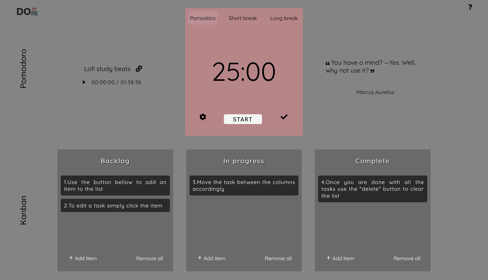

# Productivity Application 'DoItDoneIt'

### Live version of the app: 
https://doitdoneit.netlify.app/

### Application created to improve productivity, time and task management. It combines a `Kanban board`, `Pomodoro timer`, `Stoic Quotes` and `Lofi music player` for concentration.

### Pomodoro instructions: 

1. Edit the duration of the sessions and the behaviour of the pomodoro app in the settings

2. Start Pomodoro focus session

3. When the pomodoro session finishes, take a break

4. In case you select the sessions to start automatically, a long break will start after 4 Pomodoro sessions;

### Kanban Board instructions:

1. Use the button bellow to add an item to the list

2. To edit a task simply click the item

3. Move the task between the columns accordingly

4. Once you are done with all the tasks use the "delete" button to clear the list

### On every page load a new Stoic Quote will be loaded onto the page. Optionally, you can start the music player to have a one hour lofi song compilation to help you focus

### Application created using React. Feel free to fork it and make your own version of it!

### After forking the repository, run:
#### `npm start`
Runs the app in the development mode.\
Open [http://localhost:3000](http://localhost:3000) to view it in your browser.
